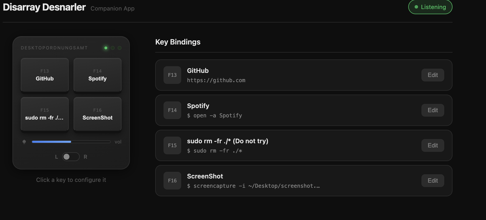

# Disarray Desnarler — Companion App

A web-based companion app for the [Disarray Desnarler](https://github.com/ZenVega/qmk_for_macropad) macropad. Configure what each key does through a browser UI — no code required.



---

## How it works

```
[Macropad] ──USB──▶ [macOS] ──F13/F14/F15/F16──▶ [Python server] ──▶ [your action]
                                                         │
                                                   http://localhost:8765
                                                   (configure in browser)
```

The macropad runs the `companion_mac` keymap, which makes the 4 keys send **F13, F14, F15, F16** — function keys macOS never uses itself, so they land cleanly in the companion server. The server listens for those keypresses, looks up what action you've assigned to each key, and runs it (shell command, app launch, or URL).

You configure everything through the web UI at `http://localhost:8765`.

---

## Requirements

- **macOS** (the app uses macOS-only libraries for keypress detection)
- **Python 3.10 or later** — check with `python3 --version`. If needed, install via [Homebrew](https://brew.sh): `brew install python`

**One-time setup** — create a virtual environment and install dependencies:

```bash
cd companion-app
python3 -m venv .venv
.venv/bin/pip install -r requirements-web.txt
```

**Accessibility permission** — `pynput` needs permission to listen for keypresses system-wide.
On first run macOS will prompt you, or grant it manually:
> System Settings → Privacy & Security → Accessibility → enable your Terminal (or IDE)

---

## 1 — Flash the macropad

Only needs to be done once, or whenever you want to change the keymap.

**Enter bootloader mode:**
1. Unplug the macropad
2. Hold the **BOOT** button on the RP2040-Zero
3. Plug USB back in — it mounts as a USB drive
4. Release BOOT

**Flash** — run from the repo root:
```bash
cd firmware
qmk flash -kb desnarler_v1 -km companion_mac
```

QMK will compile and copy the `.uf2` file automatically. The macropad reboots when done.

> First time? Run `git submodule update --init --recursive` inside `firmware/` first.

---

## 2 — Run the companion app

```bash
cd companion-app
.venv/bin/uvicorn server:app --host 127.0.0.1 --port 8765
```

Then open **http://localhost:8765** in your browser.

> Dependencies are in `.venv/` — no global install needed.

---

## 3 — Configure your keys

1. Open http://localhost:8765
2. Click any key card (or click the key in the macropad diagram)
3. Choose an action type:
   - **Shell command** — any terminal command, e.g. `open -a "Spotify"`
   - **Launch app** — app name, e.g. `Finder`
   - **Open URL** — e.g. `https://github.com`
4. Give it a label and hit **Save**

Changes take effect immediately — no restart needed.

---

## Project layout

```
firmware/                   QMK firmware (fork)
  keyboards/desnarler_v1/
    keymaps/companion_mac/  ← the keymap to flash for the app
    keymaps/default/        Linux workspace / volume control
    keymaps/midi/           MIDI notes via slider
    keymaps/wolfenstein/    zoom control
    keymaps/umlauts/        German umlaut output

companion-app/
  server.py                 FastAPI + WebSocket backend
  static/                   Web UI (HTML / CSS / JS)
  config/                   Saved key assignments (JSON)
  actions/                  Action runner (shell / app / url)
  device/                   pynput keyboard listener
  .venv/                    Python dependencies
```

---

## Known bugs & limitations

### Slider sensitivity
The analog slider fires volume up/down by comparing the ADC reading against a center value with a dead zone and a cooldown timer to avoid key-repeat flooding. In practice, getting that balance right has proven difficult — the lever either feels too twitchy or too unresponsive depending on how it's held. No satisfying solution found yet; tuning `dead_zone` and the cooldown interval in `keymap.c` is the current workaround but results vary.

### Toggle switch does nothing in the companion app
The physical toggle switch is wired to select between two layer banks in the firmware (layers 0–3 vs 4–7). This works perfectly in other keymaps (e.g. `default`, `umlauts`). However, the `companion_mac` keymap only maps **F13–F16**, and maps them identically on both banks:

```c
[0] = LAYOUT(KC_F13, KC_F14, KC_F15, KC_F16),
[1] = LAYOUT(KC_F13, KC_F14, KC_F15, KC_F16),
```

The companion app has no way to tell which bank is active — it only sees F13–F16 keypresses regardless of switch position. To make the toggle useful, the app would need either 8 distinct keycodes (one set per bank) or a separate mechanism for the firmware to signal the switch state. This is a design limitation of the current architecture, not a bug in the hardware.

---

## Hardware at a glance

| Part | Detail |
|---|---|
| MCU | RP2040-Zero |
| Keys | 4 × mechanical switch (2×2 matrix) |
| Slider | 10 kΩ potentiometer on GP0 (ADC) |
| LEDs | 3 × indicator (GP26 / GP27 / GP28) |
| Toggle | OS/layer switch on GP8 |
| Connection | USB-C wired only |
